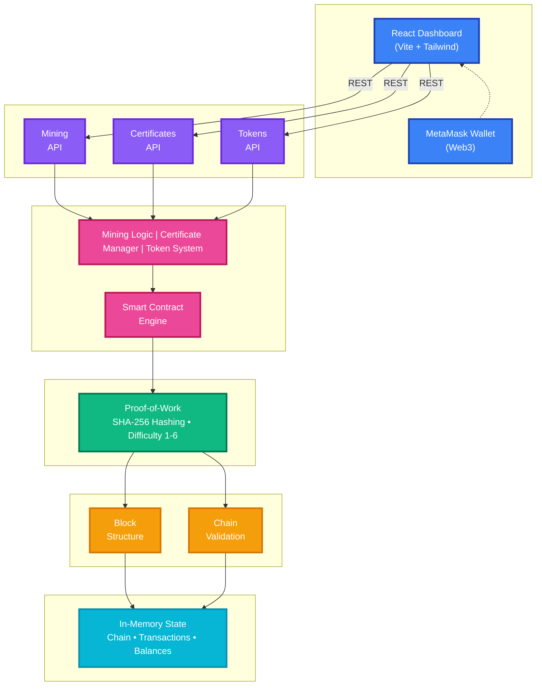

# CertaBlock


**CertaBlock** is a production-ready blockchain platform demonstrating advanced distributed systems concepts. It combines proof-of-work consensus, smart contracts, digital certificates, and token management in a unified, developer-friendly ecosystem built with Rust and React.

---

## Key Features

- **Proof-of-Work Consensus**: Secure mining with adjustable difficulty levels (1-6) and SHA-256 hashing.
- **Smart Contracts**: Execute custom business logic on-chain with deterministic contract execution.
- **Digital Certificates**: Issue, verify, and manage tamper-proof certificates with blockchain-backed authenticity.
- **Fungible Token System**: Transfer and manage MCT (Metacation Token) with built-in balance tracking.
- **MetaMask Integration**: Secure wallet authentication with secp256k1 signature verification.
- **Real-time Dashboard**: Modern React-based blockchain explorer with glassmorphism design and live updates.

---

## Architecture

The system operates on a layered architecture separating concerns while maintaining tight integration:



**Layer Legend:**

- 🔵 **Client Layer**: React Dashboard + MetaMask Wallet
- 🟣 **API Layer**: REST endpoints (Axum framework)
- 🔴 **Application Layer**: Business logic and smart contracts
- 🟢 **Consensus Layer**: Proof-of-Work mining
- 🟠 **Blockchain Core**: Block structure and validation
- 🔵 **Storage Layer**: In-memory blockchain state

---

## Project Structure

| Module                         | Description                                                  |
| :----------------------------- | :----------------------------------------------------------- |
| **[`src`](./src)**             | Rust backend with blockchain core, consensus, and API logic. |
| **[`dashboard`](./dashboard)** | React + Vite frontend providing the blockchain explorer UI.  |
| **[`docs`](./docs)**           | Comprehensive API documentation and technical whitepaper.    |

---

## Getting Started

### Prerequisites

- **Rust 1.70+** ([Install Rust](https://www.rust-lang.org/tools/install))
- **Node.js 18+** ([Install Node.js](https://nodejs.org/))
- **MetaMask** browser extension

### 1. Backend Setup

```bash
# Clone the repository
git clone https://github.com/hasancoded/CertaBlock.git
cd CertaBlock

# Build and run the backend
cargo build --release
cargo run --release
```

_The API server runs on `http://127.0.0.1:3000`._

### 2. Frontend Setup

```bash
# Navigate to dashboard directory
cd dashboard

# Install dependencies
npm install

# Start development server
npm run dev
```

_The dashboard runs on `http://localhost:5173`._

---

## Core Functionality

### Mining Operations

- Adjustable difficulty (1-6 levels)
- Real-time mining progress with nonce discovery
- Block validation and chain integrity verification

### Certificate Management

- Issue digital certificates with unique IDs
- Verify certificate authenticity via blockchain
- Track certificate status and history

### Token System

- Transfer MCT tokens between addresses
- Check account balances in real-time
- Complete transaction history

### Blockchain Explorer

- View all blocks and transactions
- Inspect detailed block information
- Validate entire blockchain integrity

---

## API Documentation

Comprehensive API documentation is available in **[`docs/API.md`](docs/API.md)**.

### Key Endpoints

| Endpoint                   | Method | Description               |
| :------------------------- | :----- | :------------------------ |
| `/mine`                    | POST   | Mine a new block          |
| `/blocks`                  | GET    | Retrieve all blocks       |
| `/certificates/issue`      | POST   | Issue a certificate       |
| `/certificates/verify/:id` | GET    | Verify certificate        |
| `/tokens/transfer`         | POST   | Transfer tokens           |
| `/tokens/balance/:address` | GET    | Check token balance       |
| `/stats`                   | GET    | Get blockchain statistics |

---

## Documentation

Comprehensive documentation is available in the [`docs`](./docs) directory:

- **[Setup Guide](./docs/SETUP.md)**: Detailed installation and configuration instructions
- **[Architecture](./docs/ARCHITECTURE.md)**: In-depth technical architecture and design decisions
- **[API Reference](./docs/API.md)**: Complete REST API documentation with examples
- **[Technical Whitepaper](./docs/WHITEPAPER.md)**: Academic-style technical whitepaper

---

## Development

### Running Tests

```bash
# Backend tests
cargo test

# Frontend tests
cd dashboard
npm test
```

### Building for Production

```bash
# Backend
cargo build --release

# Frontend
cd dashboard
npm run build
```

---

## Contributing

We welcome contributions! Please see our [Contributing Guidelines](CONTRIBUTING.md) for details.

1. Fork the repository
2. Create your feature branch (`git checkout -b feature/amazing-feature`)
3. Commit your changes (`git commit -m 'Add some amazing feature'`)
4. Push to the branch (`git push origin feature/amazing-feature`)
5. Open a Pull Request

---

## License

This project is licensed under the MIT License - see the [LICENSE](LICENSE) file for details.

---

## Acknowledgments

- Built with [Rust](https://www.rust-lang.org/) and [React](https://reactjs.org/)
- Cryptography powered by [secp256k1](https://github.com/rust-bitcoin/rust-secp256k1)
- UI components from [Radix UI](https://www.radix-ui.com/)

---

<p align="center">
  <strong>Note:</strong> This is a demonstration blockchain implementation. For production use, additional security audits and testing are recommended.
</p>
